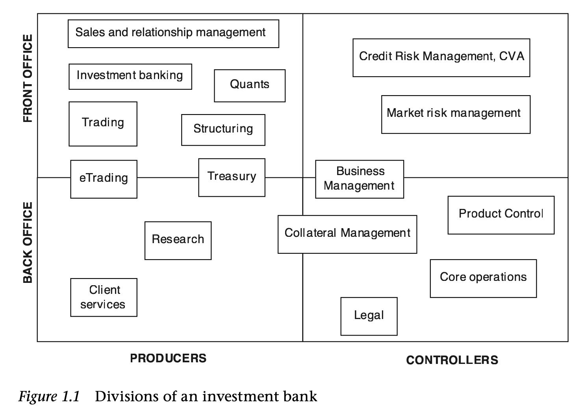
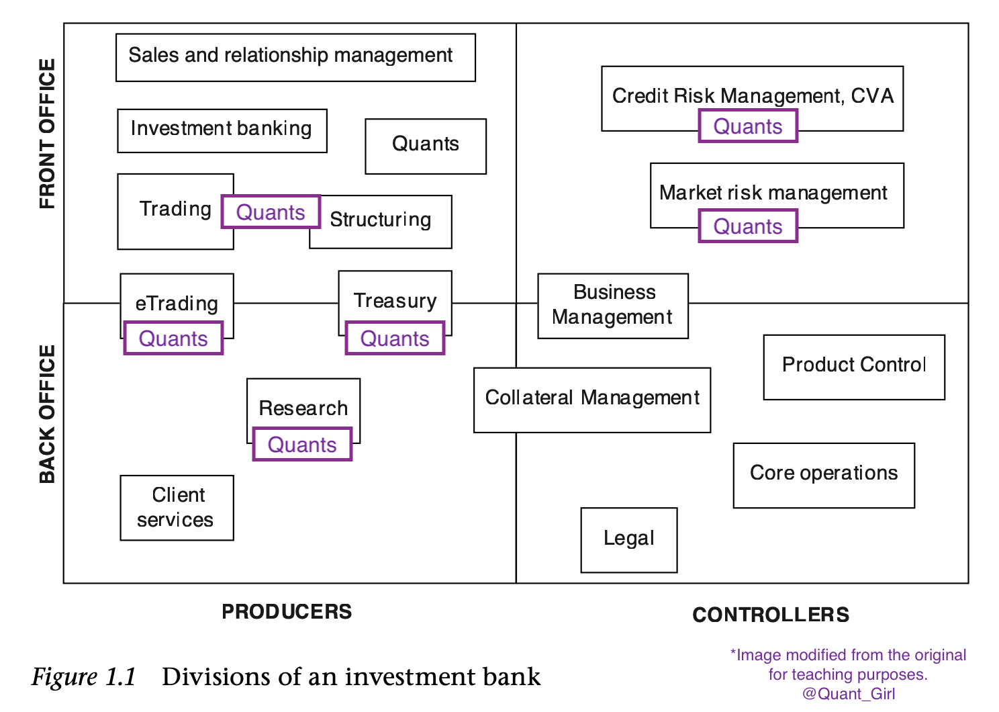
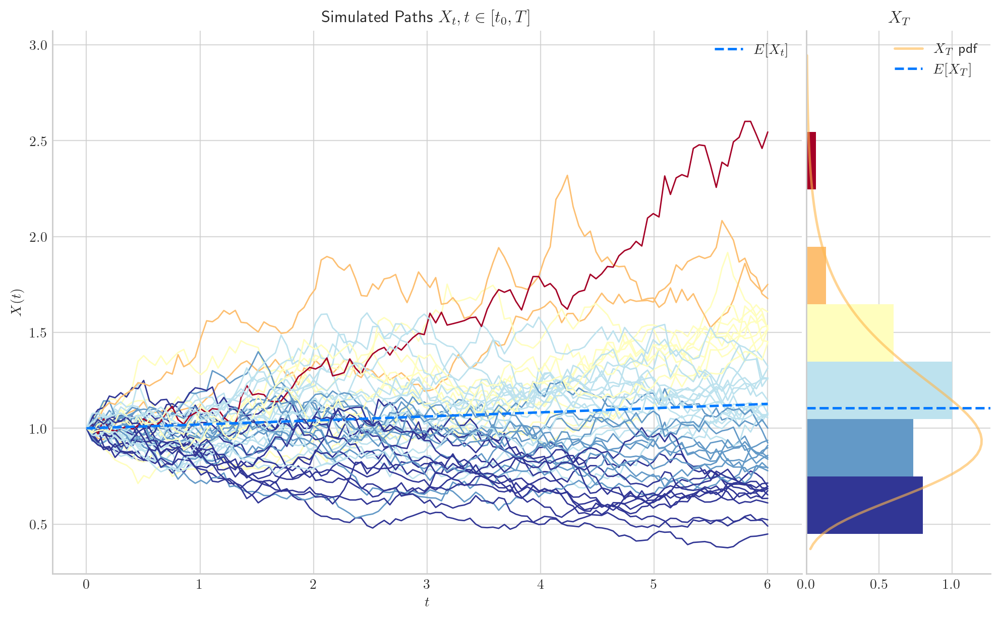
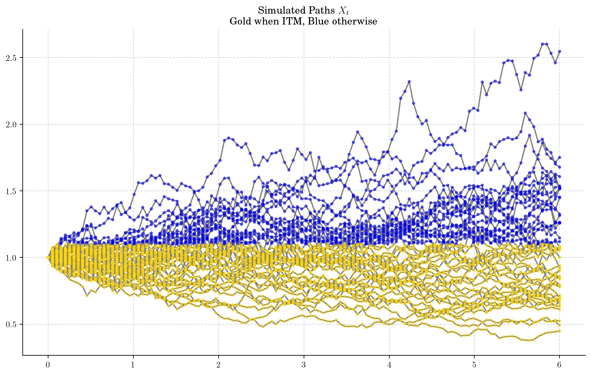
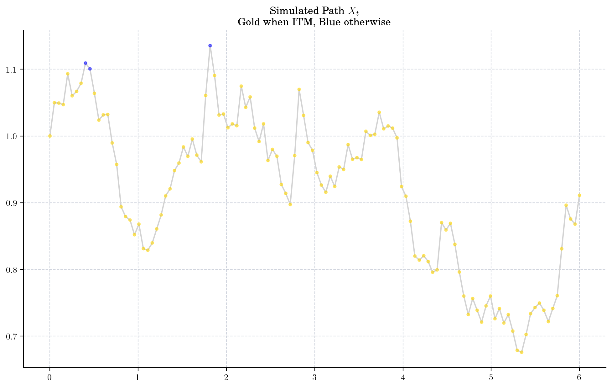
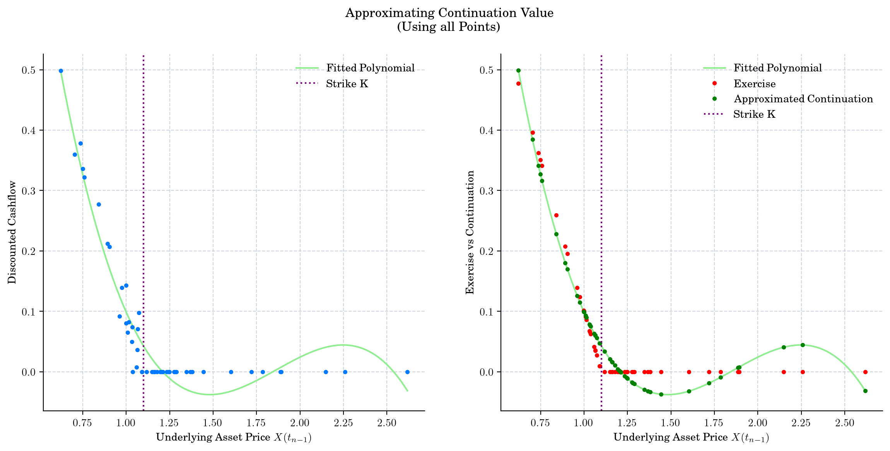
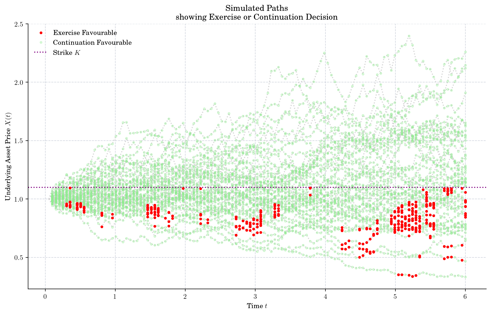
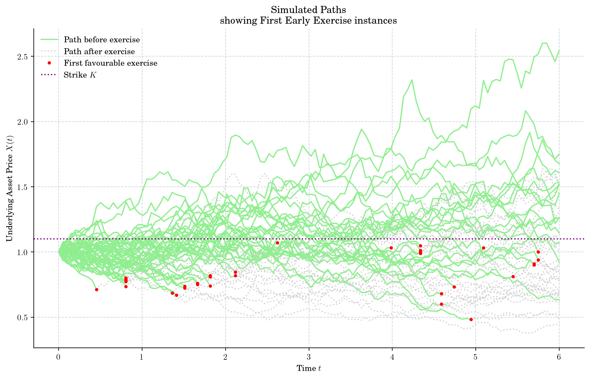

Last week, I had the privilege of delivering an expert lecture at [King's College London](https://www.kcl.ac.uk) to MSc students enrolled in the [Computational Finance](https://www.kcl.ac.uk/study/postgraduate-taught/courses/computational-finance-msc) program. This year, I opted for an extended session, spanning 2 hours instead of the usual 1, allowing us to delve deeper into a technical subject. We focused on the Longstaff Schwartz algorithm for pricing American options, thoroughly exploring its mathematical formulation, along with a practical demonstration of its implementation in Python. 🐍

Some of the points that we discussed during the session:

- I shared a bit about my experience working as a Quant after graduating from a science background and with no previous experience in Finance. It's hard to believe that I've been in this field for almost 8 years now!

- We talked about the large number of opportunities that currently exist in the Quant world. To put things in perspective, we took a look at this image from the book "[The Front Office Manual: The Definitive Guide to Trading, Structuring and Sales (Global Financial Markets)](https://www.amazon.co.uk/Front-Office-Manual-Definitive-Structuring/dp/1137030682) (2013)" by A. Sutherland, and J. Court

and commented on how much things have changed since the book was published. Today, the picture should probably look more like this one ⬇️ which translates in much more opportunities for Quants!

- Then, we passed to the more technical part of the agenda: American options, and the [Longstaff-Schwartz algorithm](https://people.math.ethz.ch/~hjfurrer/teaching/LongstaffSchwartzAmericanOptionsLeastSquareMonteCarlo.pdf), also known as Least Squares Monte Carlo (LSMC), or simply American Monte Carlo.

- <figure>
    
    
    
    <figcaption>
    
    Geometric Brownian Motion
    
    </figcaption>
    
    </figure>
    
- <figure>
    
    
    
    <figcaption>
    
    Geometric Brownian Motion showing ITM points
    
    </figcaption>
    
    </figure>
    
- <figure>
    
    
    
    <figcaption>
    
    One path GBM
    
    </figcaption>
    
    </figure>
    
- <figure>
    
    
    
    <figcaption>
    
    Continuation Value Estimation
    
    </figcaption>
    
    </figure>
    
- <figure>
    
    
    
    <figcaption>
    
    Exercise and Continuation Favourable Values
    
    </figcaption>
    
    </figure>
    
- <figure>
    
    
    
    <figcaption>
    
    First Favourable Exercise
    
    </figcaption>
    
    </figure>
    

- Finally, we had a brief discussion on alternative approaches, advantages of using Monte Carlo, and some comments on the challenges and opportunities on this area.

- You can access the lecture materials in the provided Jupyter notebook and slides here.

- [Jupyter Notebook: American Options Pricing using the Longstaff-Schwartz Algorithm](https://quantgirluk.github.io/Understanding-Quantitative-Finance/AOS.html)

Slides

  <iframe src="/docs/American_Options.pdf" allowfullscreen ></iframe>

  📄 <a href="/docs/American_Options.pdf" target="_blank">View or download PDF</a> if it doesn't load correctly.

It was amazing to deliver this lecture and have the opportunity to engage with both the students and the amazing professors who orchestrate these lecture series, acting as a crucial bridge between industry and academia.

As a quant, keeping in touch with academia holds a tremendous value. Not only does it keep you to remain current with the latest research trends, but it also infuses you with the energy and curiosity of the upcoming generations!

p.s. Big thank you to all the students for attending despite the terrible weather! Also, I need to thank you for asking so many good questions during and after the presentation.
