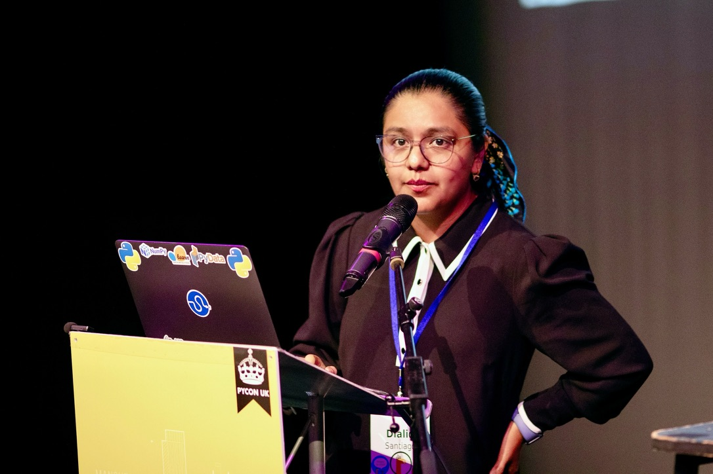

Last month, I had the opportunity to speak at **PyCon UK** for the very first time—and what an experience it was!

For those who haven’t attended before, PyCon UK is more than just a conference about Python. It’s a celebration of
community. Each year, it brings together people from diverse backgrounds—engineers, researchers, educators, hobbyists—to
share ideas, learn from one another, and showcase the many ways Python is being used across fields.

The topic I spoke on grew from a question I have often encountered: **How do you explain stochastic processes without
equations?** The answer is simple: **you show them!** By plotting and visualising these mathematical objects, we can build intuition,
reveal their behaviour, and make abstract ideas concrete.

In my talk, I shared how facing this challenge inspired me to build [**aleatory**](https://github.com/quantgirluk/aleatory), a Python library designed to visualise stochastic processes in a way that
is both intuitive and engaging. The goal was to make these concepts more approachable for students, colleagues, and
anyone curious about stochastic processes. If you are interested in this topic, you can find links to the recording and materials below.

**Talk Recording**

<iframe width="560" height="315" src="https://www.youtube.com/embed/8Pl3fvPfzDI?si=S42lljRu2QX6r8Tg" title="YouTube video player" frameborder="0" allow="accelerometer; autoplay; clipboard-write; encrypted-media; gyroscope; picture-in-picture; web-share" referrerpolicy="strict-origin-when-cross-origin" allowfullscreen></iframe>

**Slides**

  <iframe src="/docs/pycon_uk_dialid.pdf#view=FitH" allowfullscreen
          style="width:100%; height:1000px; border:none;">
  </iframe>

[//]: # (
)

[//]: # (  <iframe src="/docs/pycon_uk_dialid.pdf" allowfullscreen ></iframe>)

[//]: # (
)

  📄 <a href="/docs/pycon_uk_dialid.pdf" target="_blank">View or download PDF</a> if it doesn't load correctly.

**Links**

- [aleatory - GitHub Repo](https://github.com/quantgirluk/aleatory)
- [aleatory - Documentation](https://aleatory.readthedocs.io/en/latest/)

#### Why You Should Consider Speaking at Pycon UK

Speaking at PyCon UK was a genuinely rewarding experience—one that reminded me how much growth happens when we step
outside of our comfort zones.
If you have an idea to share, I strongly encourage you to submit a proposal for next year’s PyCon UK. You might surprise
yourself with how much you learn, how many people you meet, and how far your ideas can travel 🩵

